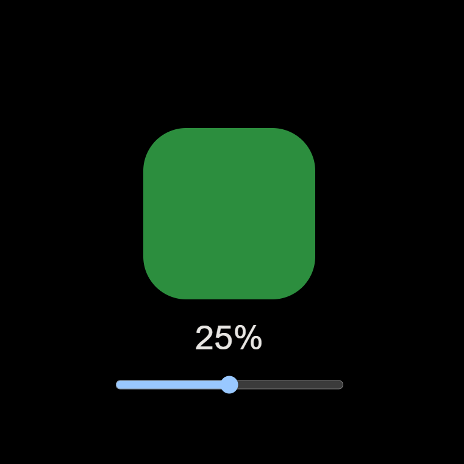
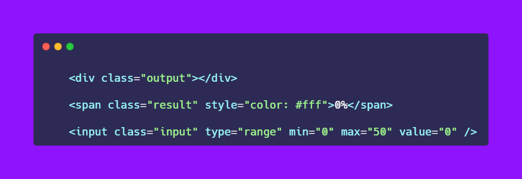
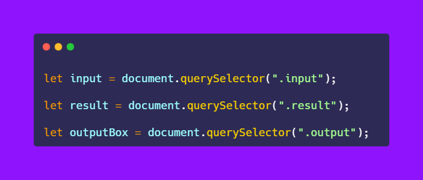
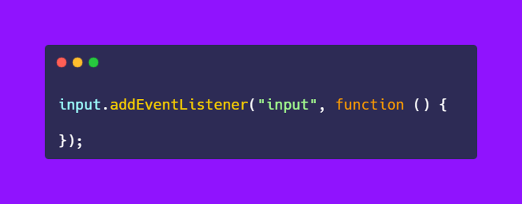
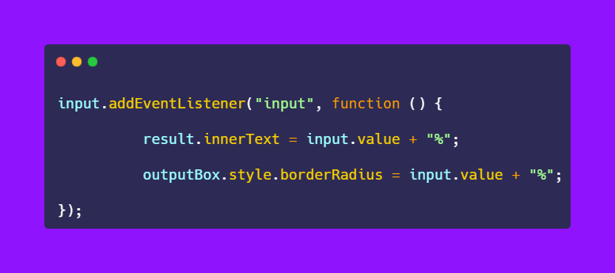

# 50-The-Ultimate-JavaScript-Projects-Series-

### 🎉 Border Radius Slider.

[Try it on codepen](https://codepen.io/atechajay/full/ExoJxzV) | [Read the thread on twitter](https://twitter.com/ATechAjay/status/1517388673469206528)

### 💡 Learning from this project?

📌 [Input event](https://developer.mozilla.org/en-US/docs/Web/API/HTMLElement/input_event)
📌 [Change border-radius value](https://developer.mozilla.org/en-US/docs/Web/CSS/border-radius)

🛠 This is also helpful when you want to build any SASS project.

___
### 🛠 How to build it? 👇

→ Here is the HTML code for this project.

→ BTW, we have to select all these elements using JavaScript.

→ Now we have selected all HTML elements using JavaScript.

📌 Input event

→ So, if we slide this range input element then the value is applied to the output box.

→ The "input" event is fired every time when a value is modified or changed by the user.

→ Or, the input event occurs when the value is modified by the user.

→ Or, The input event activates when the value of an element has been changed.

→ That's why we have to use the "input" event.

→ Now we want to display the range input value on the screen.

→ And I am going to use %(percent) unit for the border-radius property.

→ So, we have to manipulate the text based on the input value.

→ And also add the %(percent) sign to the end of the value.

→ So the value of the input element will be displayed on the screen when we slide the element with concatenation.

→ We can read the value of the input element using the "value" method.

→ That's why I have used "input.value" with concatenation.

→ It's modified the text.

→ And finally, we have to change the shape of the box based on the text which is displayed on the screen.

→ Just we have to assign that text value to the borderRadius property.

→ It's modified the box shape based on the input value.

That's all 😍

---

🔔 Don't forget to give a star ⭐ to this repository, also if you didn't follow me on GitHub then consider following me.
