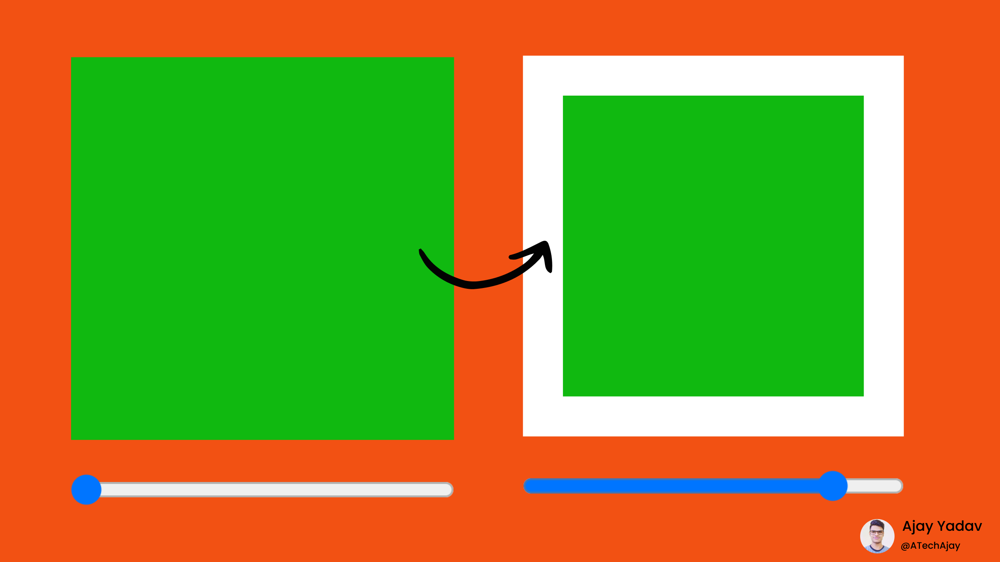
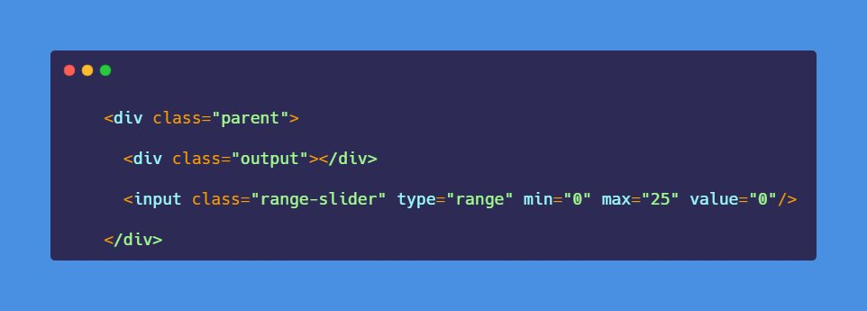
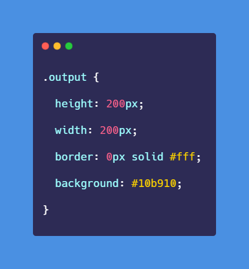
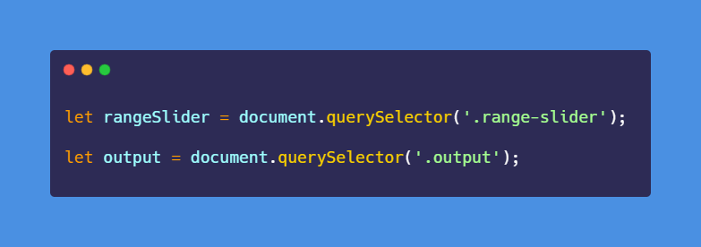
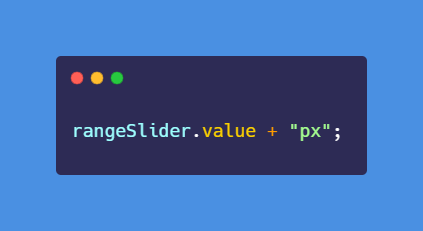

# 50-The-Ultimate-JavaScript-Projects-Series-

### 🎉Border with slider (A part of the SASS project)

[Try it on codepen](https://codepen.io/atechajay/full/XWZOqMx) | [Read the thread on twitter](https://twitter.com/ATechAjay/status/1536976588100710400)

___
### 🛠 How to build it? 👇

📌 So this is the HTML code for the project.

◈ There are 2 elements in this container that are a div element and a range slider.

◈ In range slider:
- min = 0 (px)
- max = 25 (px)
- value = 0 (Initial value for the thumb)

📌 In the CSS code, I have set 0px as the border of this div element.

◈ And just we have to change this value using JavaScript.

📌 In the JavaScript part, We have to select all required HTML elements.

◈ Like, as a div element and a range input element.

◈ Then we have to collect the value from the range input element.

◈ After getting the value, we have to concatenate it with the "px" unit.

◈ rangeSlider.value returns the value from the range input element and then concatenates it with the "px" unit.

◈ And finally, once we got the value from the input element assigned it as the value of the border-width property.

⛔ I've already discussed the "input" event in the previous threads don't forget to check it out.

That's all 😍

---

🔔 Don't forget to give a star ⭐ to this repository, also if you didn't follow me on GitHub then consider following me.
