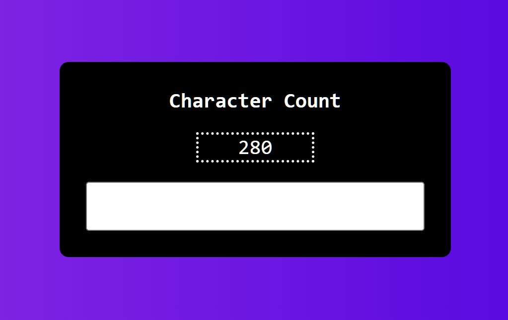
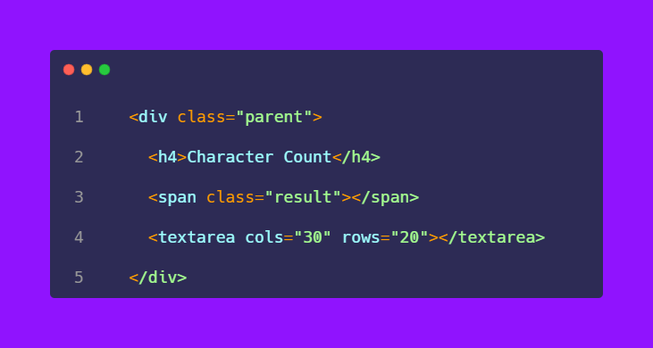
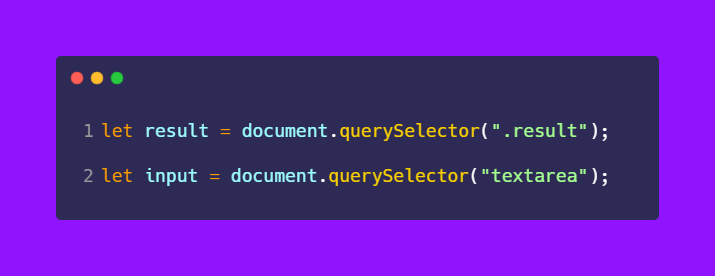
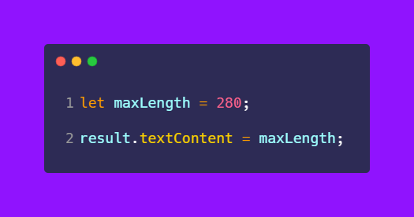
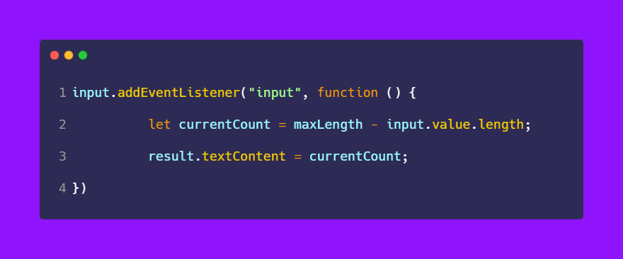
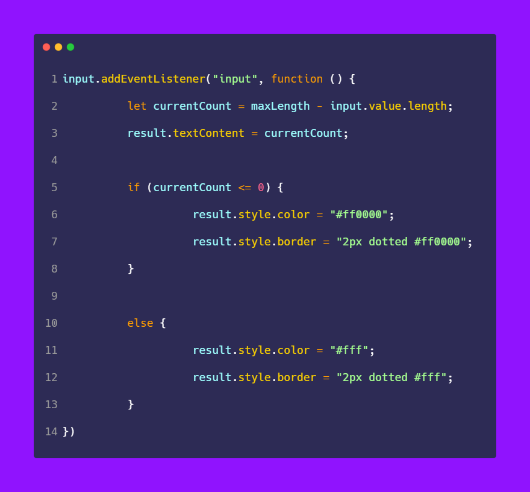

# 50-The-Ultimate-JavaScript-Projects-Series-

### 🎉 𝗧𝘄𝗶𝘁𝘁𝗲𝗿 𝗖𝗵𝗮𝗿𝗮𝗰𝘁𝗲𝗿 𝗖𝗼𝘂𝗻𝘁 𝗗𝗼𝘄𝗻

[Read the thread on twitter](https://twitter.com/ATechAjay/status/1531841330603003904)

___
### 🛠 How to build it? 👇

🛠 In this project, there are 3 child elements in a container.

1.  Heading of the project
2. Result of the number
3. Input field

😍 Now the time comes to implement a JavaScript logic for this feature.

◈ So, first of all, we have to select the required HTML elements using JavaScript.

◈ Then we have to set the maximum limit of the character in a new variable.

◈ So, the maximum number of characters will be 280, that's why I have created a new variable that is maxLength.

◈ And replace this value as an initial value of the project using textContent.

◈ Now the maximum(280) value is displayed on the screen.

◈ After that, we have to listen to an event on each character of the input field.

◈ Listen to an event on the input field which is textarea in this case.

◈ Now I've created a new variable called currentCount.

◈ In the "currentCount" variable, we have to store the current number of characters.

◈ So on each event, we have calculated the length of the characters minus the maximum length of the characters.

Eg:

280 - 12, if we input 12 characters in the input field.

◈ After that, we have to change the maximum number with the current number on each event.

◈ So we need to change the maximum number with the current number using textContent inside the function.

◈ Finally, we have to implement the text and border color when we reach at 0.

◈ Just use the "if" and "else" statement for this requirement.

◈ If the current number is less than 0, then the text and border color will be red else white.

That's all 😍

---

🔔 Don't forget to give a star ⭐ to this repository, also if you didn't follow me on GitHub then consider following me.
