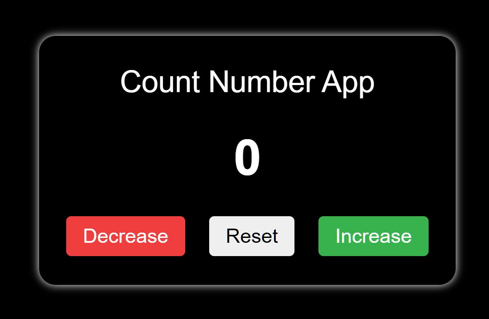
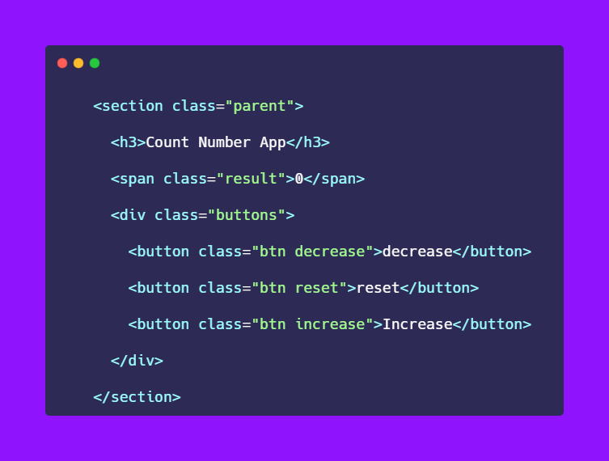
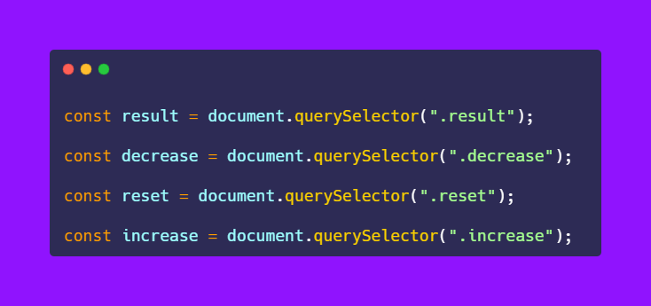
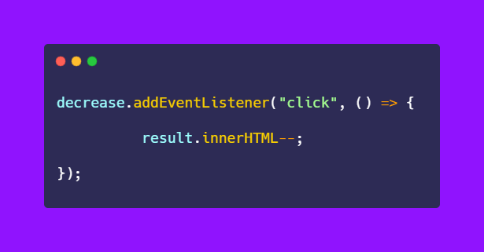
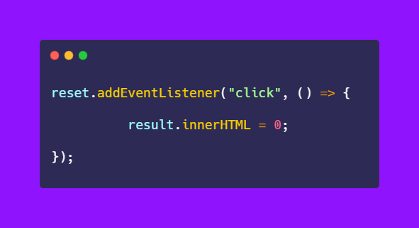
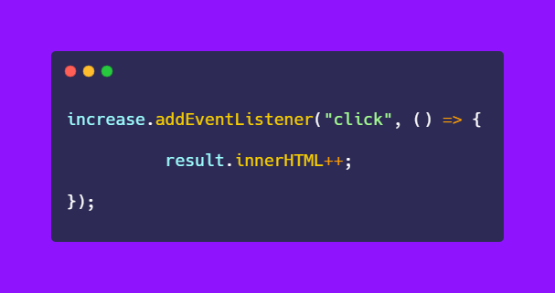
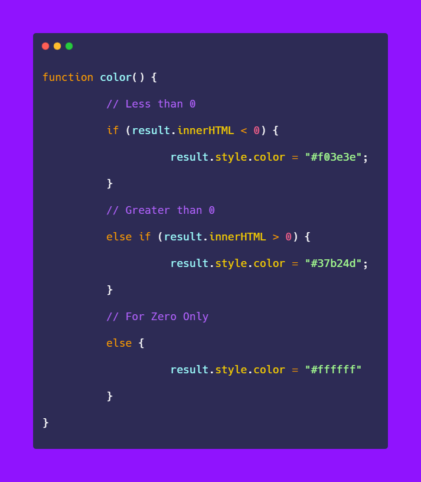
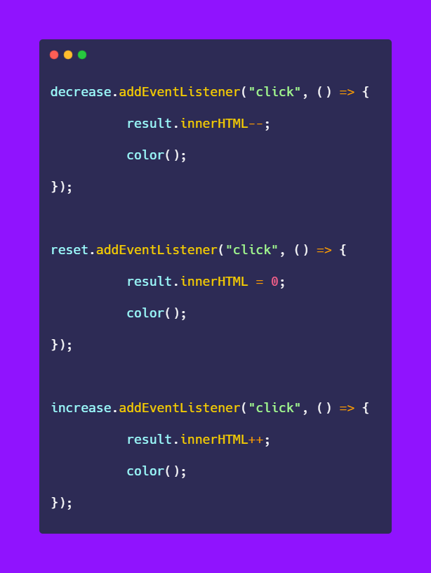

# 50-The-Ultimate-JavaScript-Projects-Series-

### 🎉 Count Number App

[Try it on codepen](https://codepen.io/atechajay/full/OJzBbJO) | [Read the thread on twitter](https://twitter.com/ATechAjay/status/1515577515091263492)

### 📌 Learning from this project?

① [Select HTML elements using JavaScript.](https://developer.mozilla.org/en-US/docs/Web/API/Document/querySelector)

② [Click event](https://developer.mozilla.org/en-US/docs/Web/API/Element/click_event)

③ [innerHTML](https://developer.mozilla.org/en-US/docs/Web/API/Element/innerHTML)

④ [Color change of the number using if and else statement.](https://developer.mozilla.org/en-US/docs/Web/JavaScript/Reference/Statements/if...else)

___
### 🛠 How to build it? 👇

📌 This is the HTML code of this project.

⛔ I am not going to discuss HTML and CSS code, you can just copy and paste from the codepen link or you can design as your requirement.

👀 HTML code is required for select elements using JavaScript.

① Select HTML elements using JavaScript.

→ Now we have to select HTML elements for dynamic effect, using JavaScript.

→ You can learn from this thread, that how to select HTML elements using javascript.

[💛 Day 3️⃣2️⃣ / 3️⃣0️⃣ days of basics in JavaScript series!
](https://twitter.com/ATechAjay/status/1511945191657127939)

→ Here I am going to use the query sector for selecting HTML elements.

→ Now in this project, we have to select 4 HTML elements.

1. Result text for manipulating
2. Decrement button
3. Reset button
4. Increment button

 👀 Like this 👇

② Click event

→ Now we have to listen to an "event" on the buttons, which is a "click" event.

→ "click" is the name of the event and this is case-sensitive.

→ It is used when the mouse click on an element then the click event will be fired.

→ So, when we click on the decrease button then the value of the number will be decrease.

→ And there is an arrow function that is handling this requirement also known as an event handler.

→ Or, the event handler for the "click" event.

→ And, when we click on the reset button then the value of the number will be 0.

→ Now, when we click on the increase button then the value of the number will be increased.

③ innerHTML

→ It is used to get the content of an HTML element.

→ Or, used to insert or get HTML content in the document.

→ So we want to change the content of the result on each click, that's why we have to use the increment or decrement operator on inner HTML elements.

④ Color change of the number using if and else statement.

→ Now I want to change the color of the result text as follows:

- Less than 0 = "red"
- For 0 = "White"
- Greater than 0 = "Green"

→ We can define a function for this work.

→ So for this, we can use the if and else statement as a function.

→ If the result is > 0 then the color of the text will be green.

→ Or, if the result = 0 then the color of the text will be white.

→ Or, if the result < 0 then the color of the text will be red.

→ Finally, we have to call this function in each event handler function.

→ color(); = Calling or invoking or running the function.

That's all 😍

---

🔔 Don't forget to give a star ⭐ to this repository, also if you didn't follow me on GitHub then consider following me.
