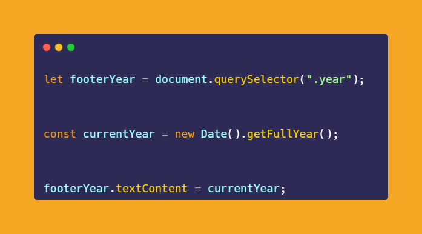

# 50-The-Ultimate-JavaScript-Projects-Series-

### 🎉 Footer Date Auto Update

[Try it on codepen](https://codepen.io/atechajay/pen/KKoKbmG) | [Read the thread on twitter](https://twitter.com/ATechAjay/status/1542098394037878785)

### 💡 Learning from this project?

    1. [Date()](https://developer.mozilla.org/en-US/docs/Web/JavaScript/Reference/Global_Objects/Date)
    1. [getFullYear()](https://developer.mozilla.org/en-US/docs/Web/JavaScript/Reference/Global_Objects/Date/getFullYear)

___
### 🛠 How to build it? 👇

📌 As a web developer, we have to make sure to always keep updated our website.

📌 The Footer section is one of them because here we have to keep updating the year.

😍 That's why this thread comes to the rescue.

- Just we have to call the Date( ) function using the "getFullYear()" method.

- getFullYear() returns the year in the form of 4 digits.

- And assign it as the date of the footer section.

That's all 😍

---

🔔 Don't forget to give a star ⭐ to this repository, also if you didn't follow me on GitHub then consider following me.
