# 50-The-Ultimate-JavaScript-Projects-Series-

### 🎉 Modal or Popup Window

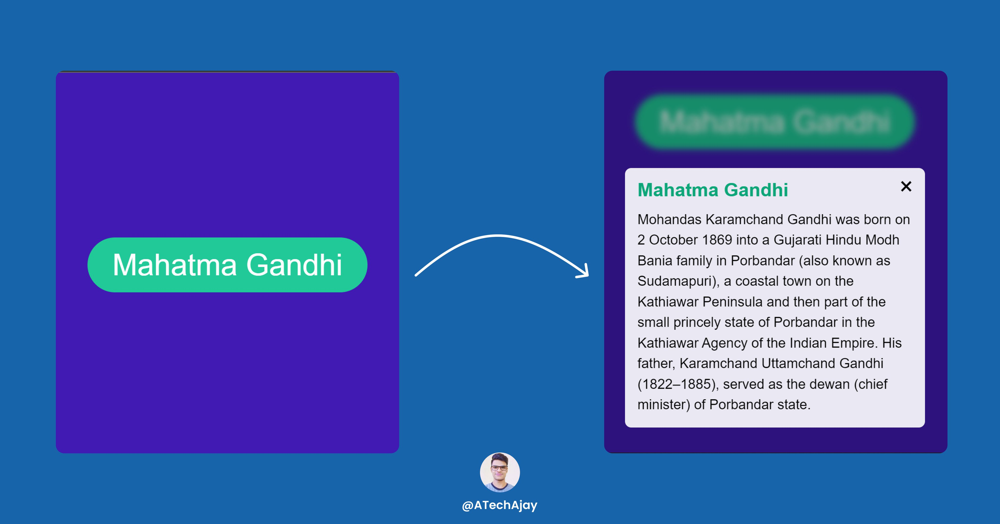

[Try it on codepen ( part 1)](https://codepen.io/atechajay/full/zYpeaYj)
[Try it on codepen ( final)](https://codepen.io/atechajay/full/jOYJByN)
[Read the thread on twitter](https://twitter.com/ATechAjay/status/1516638620316143618)


### 📌 Learning from this project?

① How to remove the class from the element.

② How to add class to the element.

③ [Keyboard event.](https://www.geeksforgeeks.org/onkeypress-onkeyup-and-onkeydown-events-in-javascript/)

📌 3 ways to close the modal

1. Close button
2. Escape key
3. Click outside from the content of the modal

___
### 🛠 How to build it? 👇

⛔ I am not going to discuss HTML and CSS code, you can just copy and paste from the codepen link or you can design as your requirement.

📌 But HTML code is important for the selection using JavaScript, so you see it in the image👇

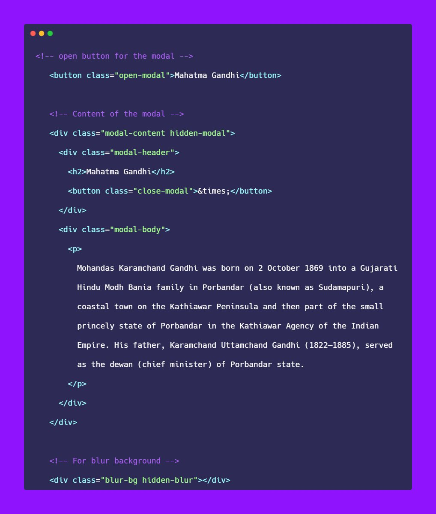

📌BTW, we have to create all elements of the modal and just we have to manipulate that modal using JavaScript.

💡Simple Logic

⇾ Initially, the content of the modal will be hidden by default.

⇾ But when we click on this button 👇 then the content of the modal will be visible.


💡 In short

⇾ When we click on the button then the "hidden-modal" class will be removed from the content of the modal.

⇾ There are 2 classes in the content of the modal.

1. modal-content
2. hidden-modal

1. modal-content: Modal content is designed by using this class.

2. hidden-modal: But this class has only one line of code that is "display: none",

📌 If we remove the "hidden-modal" class then the content of the modal will be visible.

📌 Or, if we click on the Close button or Escape key or Outside from the content of the modal then the "hidden-modal" will be added.

⇾ We can close the modal using 3 ways.

1. Using the close button
2. Using the Escape key
3. And click outside from the content of the modal.

🛠 In short

✨ To visible the modal = we have to remove the hidden class

✨ To hide the modal = we have to add the hidden class

📌 Now in this project, we have to select 4 HTML elements.

1. Open button
2. Content of the modal
3. Close button
4. Blur background


⇾ So now when we click on the open button then the "hidden-modal" class will be removed.

⇾ Well, we can add or remove the class using the "classList" property.

📌 What is classList? [See the MDN web docs](https://developer.mozilla.org/en-US/docs/Web/API/Element/classList)

⇾ The classList property returns the CSS class names of an element.

⇾ Or, it returns the DOMTokenList.

⇾ DOMTokenList is the collection of the class.

⇾ classList is the read-only property and has methods as well.

⇾ Or, the classList property has methods which used to manipulate the class of an element.

📌 Methods of the classList

⇾ add( ) :- Add one or more class to the element.

⇾ remove ( ) :- Remove one or more classes from the element.

⇾ contains ( ) :- Returns true if the element contains the given class otherwise returns false.

⛔ And many more methods of classList property, which we will discuss in the upcoming projects.

① How to remove the class from the element.

⇾ We can remove the class to the element using the remove() method of the classList property.

⇾ But it happens when we click on the open button.

⇾ So we have to listen to an event which is a "click" event on the open button.

📌 Also, we have a blurred background and have 2 classes as well.

1.  blur-bg (Blur bg design using this class)
2. hidden-blur (display: none)

⇾ Now again we have to remove this "hidden-blur" class when we click on the open button.


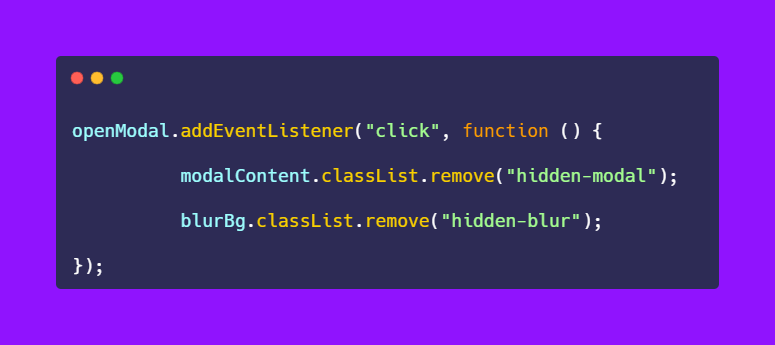

🎉 Congratulations your modal is successfully opened.

⚠ Now we have to implement the close button in the next thread.

⛔ In the next thread, we will learn

💡 3 ways to close the modal


## 🎉 Implementing the closing event function to the modal.
___

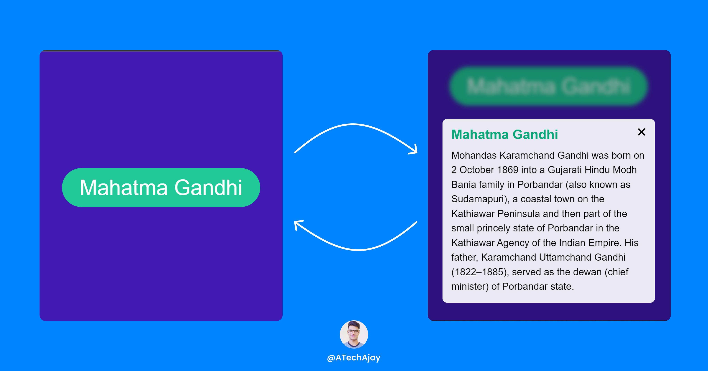

💡 As we already know that there are 3 ways to close the modal.

1️⃣ Using the close button
2️⃣ Using clicking outside from the modal
3️⃣ Using the "Escape" key


[📌 Here is the important logic for the opening and closing of the modal. ](https://twitter.com/ATechAjay/status/1516638648065699844)

🛠 In short

📌 Here is the important logic for the opening and closing of the modal.

1. ✨ To visible the modal = we have to remove the hidden class

1. ✨ To hide the modal = we have to add the hidden class

1️⃣ Using the close button

→ For closing the modal we have to add the "hidden-modal" class using add( ) method of the classList property.

→ Because of hiding the modal, we have to add the "hidden-modal" class.

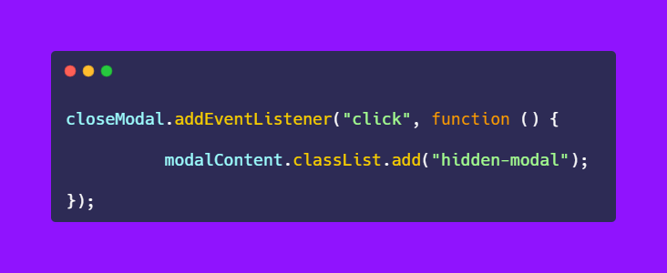

2️⃣ Using clicking outside from the modal

→ When we click outside the modal, we have to add the "hidden-modal" class using add( ) method of the classList property.

→ Because of hiding the modal, we have to add the "hidden-modal" class.

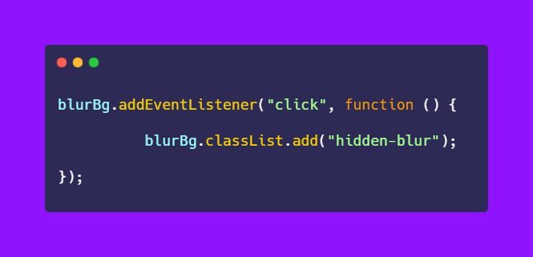

🛠 Minimize the line of code

→ Have you noticed that both event listeners are the same, we can also define a single function to tackle this problem.

→ Just we have to create a named function then we can call on both click events.

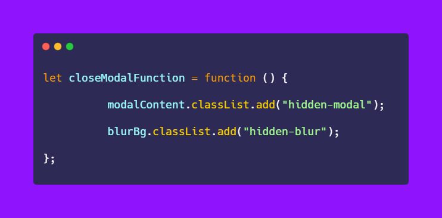

→ And just we have to add that named function on both click events.

⛔ We do not have to call the function, JavaScript automatically calls functions when the click event happens.

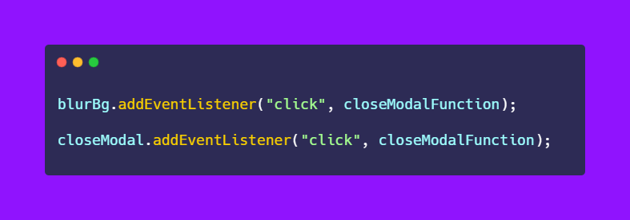

3️⃣ Using the "Escape" key

→ Now we have to implement closing the modal using the "Escape" key.

→ These are global events that fired globally.

→ It represents the single interaction between the user and the key on the keyboard.

📌 There are 3 types of keyboard events.

1. keyup
2. keydown
3. keypress (outdated)


1) keyup :- When the user releases the key, then the "keyup" event is fired.

2) keydown :- When the user first pressed the key, then the "keydown" event is fired.

→ Now we have to listen to an event to the entire document for the key event.

→ For finding the name of the key we have to pass a parameter to the function.

→ Here, "event" is the parameter of the function.


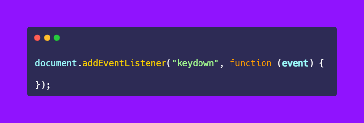


→Now we can see the multiple keyboard event properties.

→ If I log this function to the console, you can see the name of the button and many more properties.


→ And we can also find the name of the key using 🅴🆅🅴🅽🆃.🅺🅴🆈 method.

- event = parameter
- key = method of keyboard event

→ So, now we want to hide the modal when we pressed the "Escape" key.

→ First of all, we have to check that our key is equal to the "Escape" key or not using the "if" statement.


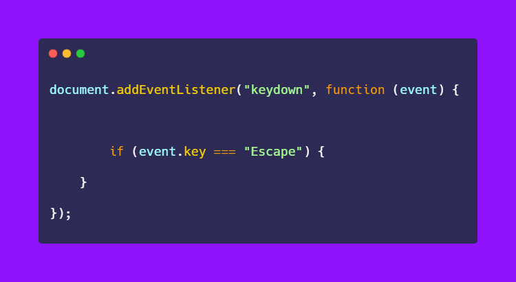

→ Then we have to again check if the modal contains the "hidden-modal" class or not.

⛔ Remember:

📌 To visible the modal = we have to remove the hidden class

📌 To hide the modal = we have to add the hidden class

→ In this case, we want to hide the class.

→ Now check if the modal contains the "hidden-modal" class or not.

- If yes = hide
- Or if not = show

→ So, in this case, we have to add a "hidden-modal" class when we pressed the "Escape" key.

→ That's why we have to invert this condition using the logical not operator.

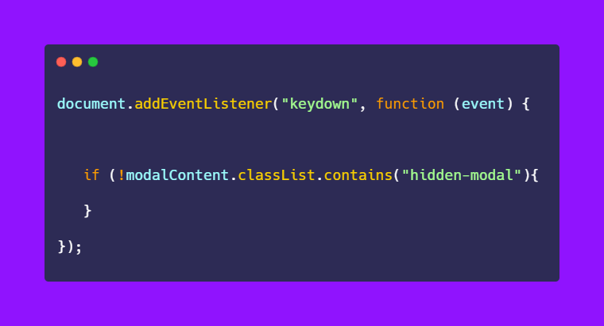

→ That means we have to add the "hidden-modal" class.

→ Then we have to call the previous functions to add the "hidden-modal" class.

⛔ Remember hidden-modal class has only one line of code that is "display: none"

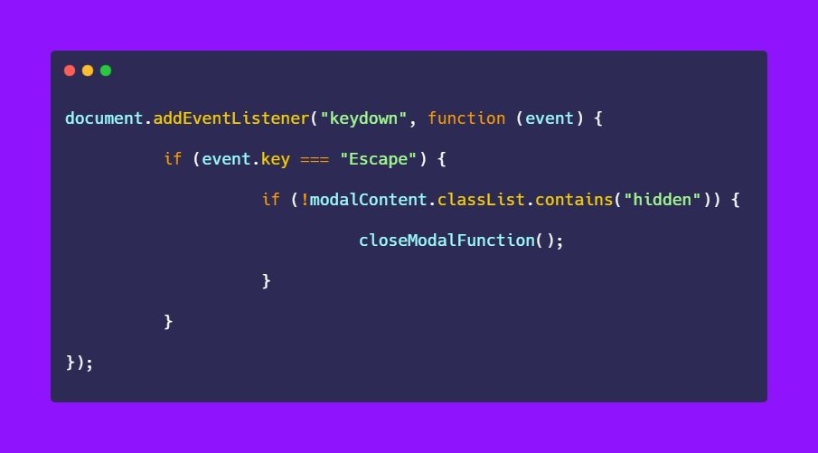

🛠 Minimize the line of code

→ We can also replace the nested if statement using the logical AND operator(&&)

```Javascript
𝗶𝗳 (𝗲𝘃𝗲𝗻𝘁.𝗸𝗲𝘆 === "𝗘𝘀𝗰𝗮𝗽𝗲" && !𝗺𝗼𝗱𝗮𝗹𝗖𝗼𝗻𝘁𝗲𝗻𝘁.𝗰𝗹𝗮𝘀𝘀𝗟𝗶𝘀𝘁.𝗰𝗼𝗻𝘁𝗮𝗶𝗻𝘀("𝗵𝗶𝗱𝗱𝗲𝗻")){
}
```

That's all 😍

---

🔔 Don't forget to give a star ⭐ to this repository, also if you didn't follow me on GitHub then consider following me.
