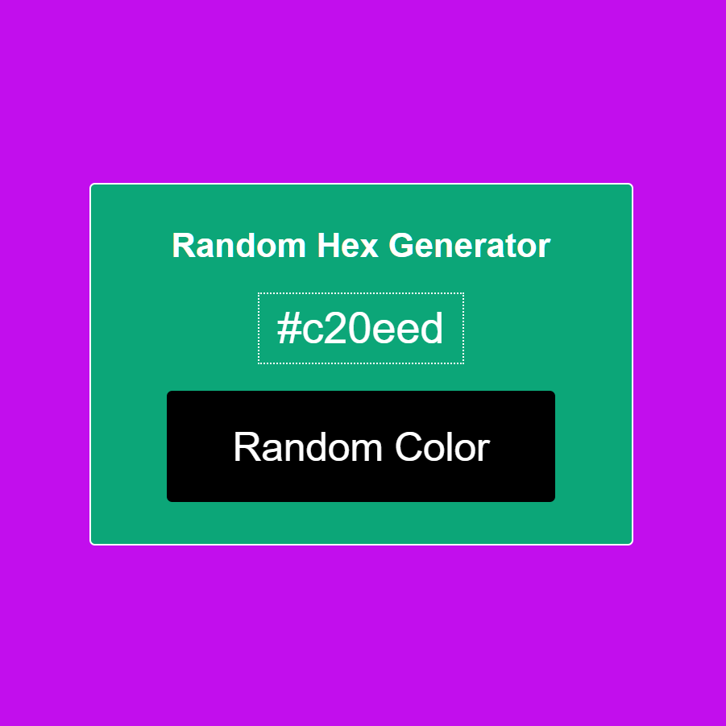
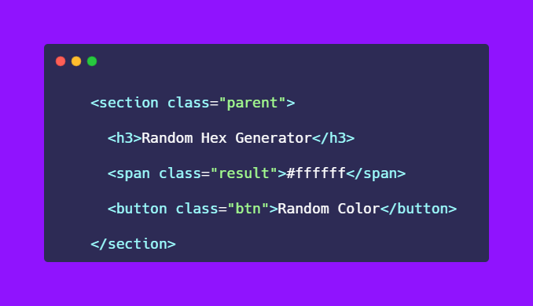
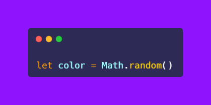
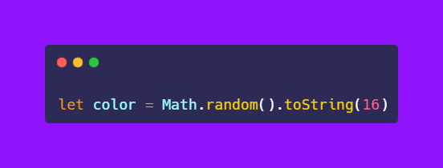
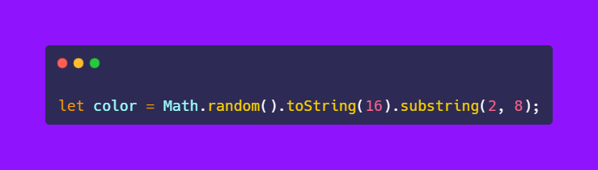
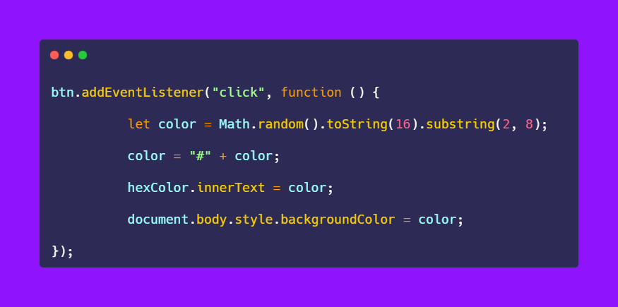

# 50-The-Ultimate-JavaScript-Projects-Series-

### 🎉 𝗥𝗮𝗻𝗱𝗼𝗺 𝗛𝗲𝘅 𝗖𝗼𝗹𝗼𝗿 𝗚𝗲𝗻𝗲𝗿𝗮𝘁𝗼𝗿

[Try it on codepen](https://codepen.io/atechajay/pen/mdXbBGx) | [Read the thread on twitter](https://twitter.com/ATechAjay/status/1519959436307034112)

### 💡 Learning from this project?

📌 toString( ) Method
📌 subString( ) Method
___
### 🛠 How to build it? 👇

⛔ I am not going to discuss HTML and CSS code, you can just copy and paste from the codepen link or you can design as your requirement.

📌 But HTML code is important for the selection using JavaScript, so you see it in the image👇

⛔ We already learn about the random method of the math function in the previous project.

→ So random( ) method is also used in this project.

→ It generates the number between 0 to 0.99

→ Random methods generate a number between 0 to 0.99

👀 For example, it generates a number like 0.53434243534

→ Now we have or remove 0 and dot from this number.

→ So our new number = 53434243534

→ And finally, we have to extract 6 digits from this number using indexes.

📌 toString( ) Method [MDN web docs](https://developer.mozilla.org/fr/docs/Web/JavaScript/Reference/Global_Objects/String/toString)

→ It allows you to convert any "Number" data type into a "string" data type.

→ toString method accepts a parameter which is the base or radix of a number.

⛔ Base = Radix

- Binary = base 2
- Octal = base 8
- Decimal = base 10
- Hex = base 16

→ The base or radix allows you to convert one number to another number.

👀 For example:

- into binary
- into octal
- into decimal
- into hex, etc

→ The base will be a number from 2 to 36.

🛠 So we have to convert it into a hex number that's why we have to pass 16 as a parameter of the toString( ) method.

📌 subString( ) Method [MDN web docs](https://developer.mozilla.org/fr/docs/Web/JavaScript/Reference/Global_Objects/String/substring)

→ It is a part or subset of the string.

→ Or, it is used to get one or more parts from the string.

→ It has 2 parameters which are the start index and end index.

⛔ Now your random color can be 5a4fc243534

→ And we have to extract 6 digits from this number using the subString( ) method.

👀 So:

Index 0 = 0
Index 1 = dot(.)
Index 2 = 5
Index 3 = a
Index 4 = 4
Index 5 = f
Index 6 = c
Index 7 = 2
Index 8 = 4 (excluded)

→ That's why we have to pass parameters from 2 to 8 in the subString( ) method.

→ That's all just we have to implement this line of code into to event listener.

→ Finally, we have to concatenate the (#) symbol to the beginning of the string.

→ And changed the background color as the random color generated.

That's all 😍

---

🔔 Don't forget to give a star ⭐ to this repository, also if you didn't follow me on GitHub then consider following me.
