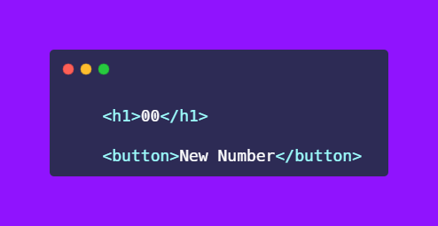
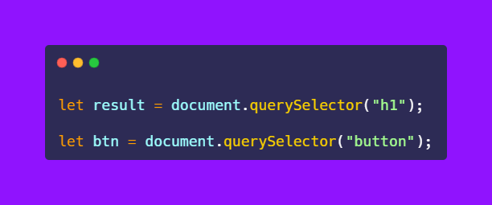
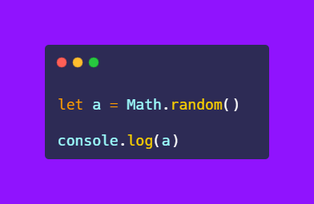
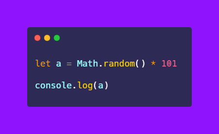
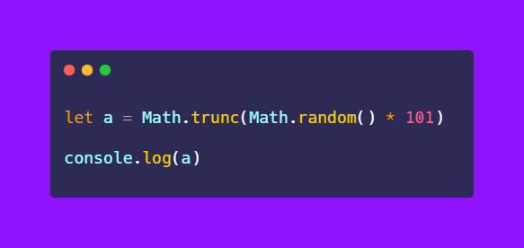
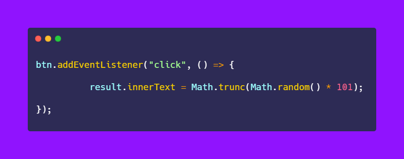

# 50-The-Ultimate-JavaScript-Projects-Series-

### 🎉 Random Number Generator

[Try it on codepen](https://codepen.io/atechajay/pen/rNpgOrP?editors=1010) | [Read the thread on twitter](https://twitter.com/ATechAjay/status/1518198383789236224)

### 💡 Learning from this project?

📌 [Math Object](https://developer.mozilla.org/en-US/docs/Web/JavaScript/Reference/Global_Objects/Math)
📌 [Random Method](https://developer.mozilla.org/en-US/docs/Web/JavaScript/Reference/Global_Objects/Math/random)
📌 [Trunc Method](https://developer.mozilla.org/en-US/docs/Web/JavaScript/Reference/Global_Objects/Math/trunc)

🛠 It's used when we want to build a ludo/dice game.
___
### 🛠 How to build it? 👇

→ This is the HTML code for this small project.

→ First of all, we have to select these HTML elements using JavaScript.

→ Now we have to use the random method of the Math function of JavaScript.

📌 Math Object

→ Math object all you to perform the mathematical tasks on numbers.

→ Properties and methods can be called using the Math object.

→ Math object works only with the number data type.

→ The Math object is a built-in object that has some properties and methods for mathematical calculations.

📌 Random Method

→ This is a method of the Math object that is used to generate random numbers.

→ It generates random numbers between 0 and 1 but less than 1.

→ But if we want to generate in the bigger range then we have to multiple with that max number.

→ Now the number generated will be between 0 to 100 or 0 to 101 but 101 is not included.

→ But this method generated a number with decimal values that's why we have to remove that fractional numbers.

📌 Trunc Method

→ This is also a method of the Math object that is used to remove fractional digits after the dot.

→ Or, it returns the integer value.

→ Or, its return a value without fractional value.

→ Or, it truncates the digit to the right of the dot in other words it simply removes the fractional digit.

→ This method is newly added in JavaScript(ES6)

→ So finally, we have to implement a click event on this button and change the number on each click.

→ It returns the number between 0 to 100.

That's all 😍

---

🔔 Don't forget to give a star ⭐ to this repository, also if you didn't follow me on GitHub then consider following me.
