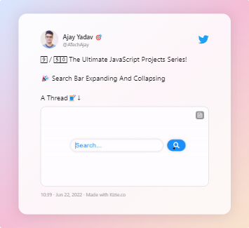
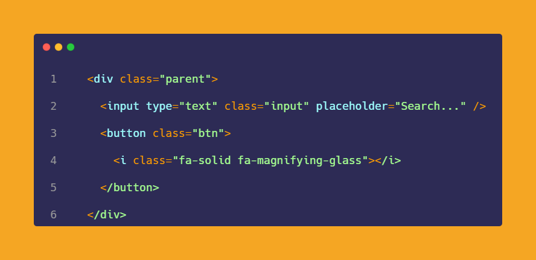
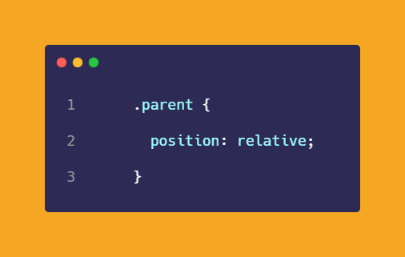
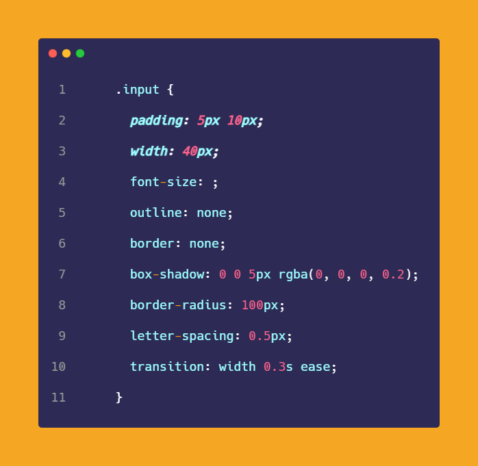
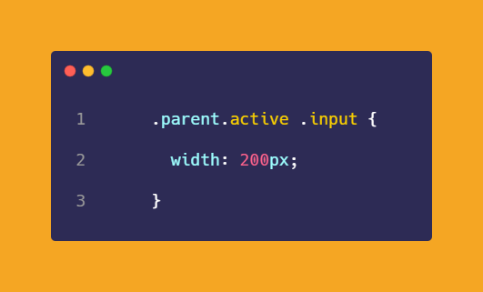
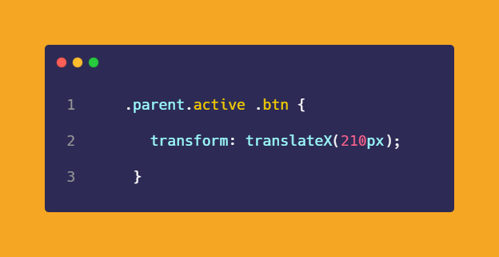
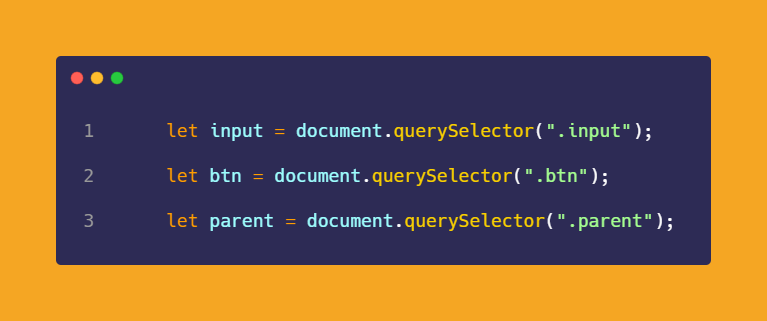
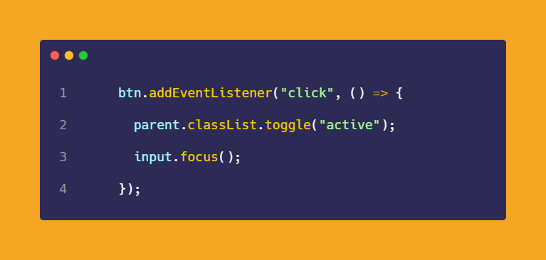

# 50-The-Ultimate-JavaScript-Projects-Series-

### 🎉 Search Bar Expanding And Collapsing

[Try it on codepen](https://codepen.io/atechajay/full/PoQrZwx) | [Read the thread on twitter](https://twitter.com/ATechAjay/status/1539498364227620866)

___
### 🛠 How to build it? 👇

💡 Here is the HTML code for this design!

◩ There are 2 elements inside the "parent"  container.

◩ Which are the input and button elements.

◩ And, I have used the "fontawesome" search icon.

💡  We have to align both elements on each other, the button will be over the input element.

◩ That's why we have positioned both elements.

💡 Initially, we have to set the same "width" on both elements.

◩ In this case, I have set 40px width in both of them.

💡 And just we have toggle "active" class with JavaScript.

◩ If the "parent" element has a ".active" class then the "width" of the ".input" element will be 200px.

◩ If the "parent" element has a ".active" class then the ".btn" element will be transform(move) to the x-direction to 210px.

◩ And finally, we have to implement the JavaScrip part, Select all required HTML elements using JavaScript.

◩ When we click on the button then the ".active" class will be toggled.

💡 Also if the search bar is expanded then the cursor will be blinking in that field using the focus( ) method.

◩ The `focus()` method sets focus on the specified element.

That's all 😍

---

🔔 Don't forget to give a star ⭐ to this repository, also if you didn't follow me on GitHub then consider following me.
