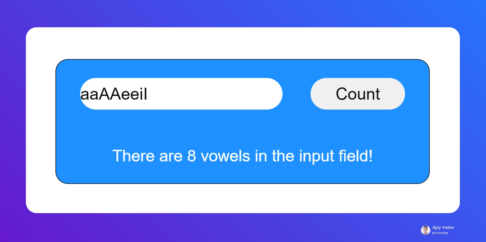
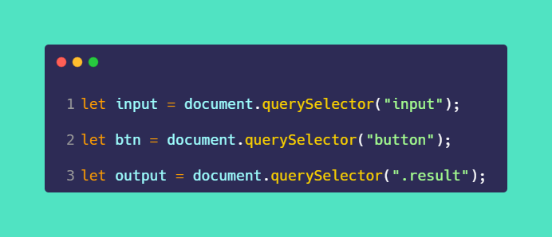
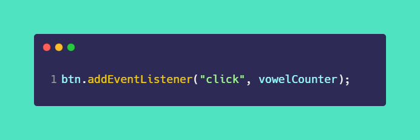
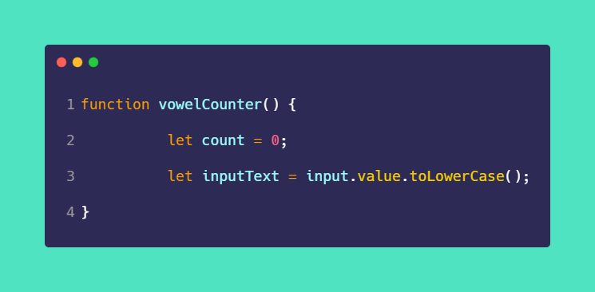
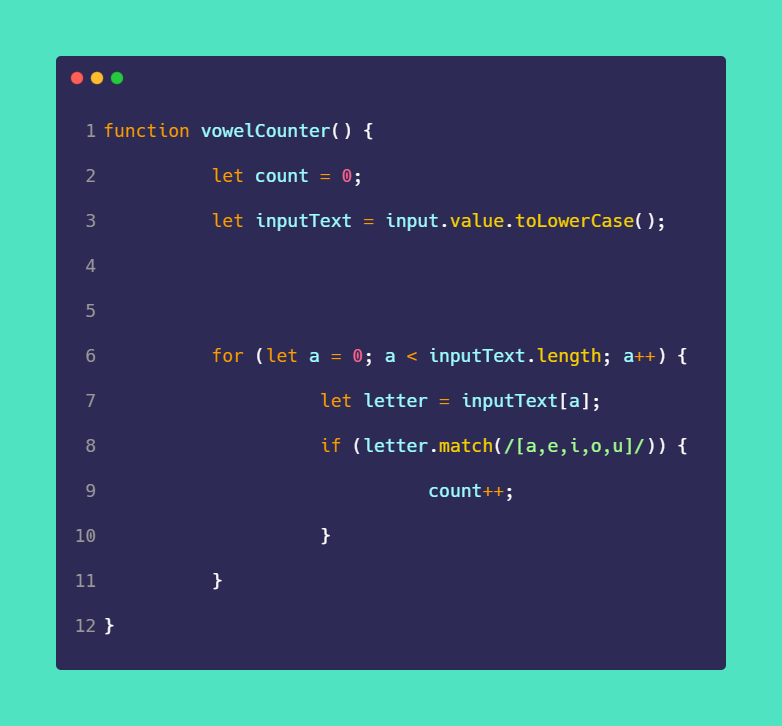
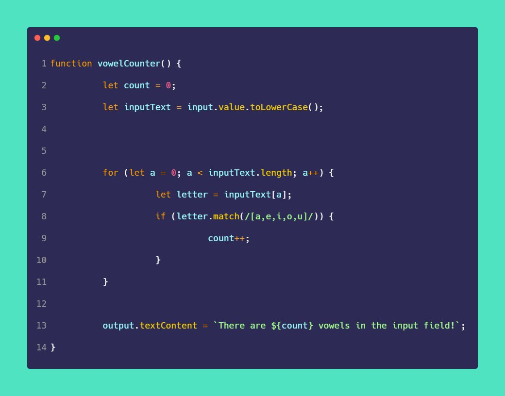

# 50-The-Ultimate-JavaScript-Projects-Series-

### 🎉 𝗩𝗼𝘄𝗲𝗹 𝗖𝗼𝘂𝗻𝘁𝗲𝗿

[Try it on codepen](https://codepen.io/atechajay/full/vYdVegQ) | [Read the thread on twitter](https://twitter.com/ATechAjay/status/1534739472549433344)

### 💡 Learning from this thread!

📌 [Regular Expression](https://developer.mozilla.org/en-US/docs/Web/JavaScript/Guide/Regular_Expressions)
📌 [toLowerCase](https://developer.mozilla.org/en-US/docs/Web/JavaScript/Reference/Global_Objects/String/toLowerCase)

Regular Expression in JavaScript? [This is a prerequisite for this thread!](https://twitter.com/ATechAjay/status/1533657627787288579)

___
### 🛠 How to build it? 👇

◈ So first of all, we have to select the HTML elements using JavaScript.

◈ Now we have to listen to a "click" event on the button element and vowelCounter is a function.

😍 Now let's create this function in 3 steps.

1️⃣ Inside this function we have set 0 to the "count" variable initially.

◈ Users can put characters lower and capital letters at the same time that's why we have to change the "case" in one of them.

◈ So I've converted all characters into lowercase using the toLowerCase( ) method.

◈ The toLowerCase( ) method converts a string to lower case letters.

◈ And of course, it doesn't change the original string.

◈ Converted all letters into the small case using this method.

2️⃣ Now we have to iterate all letters using for loop.

◈ Let's create a new variable for individual characters.

◈ And just check a character vowel or not using regular expression.

◈ If the character matches with regular expression then we have to increase the count variable.

◈ And finally, print that "count" value on the screen.

That's all 😍

---

🔔 Don't forget to give a star ⭐ to this repository, also if you didn't follow me on GitHub then consider following me.
