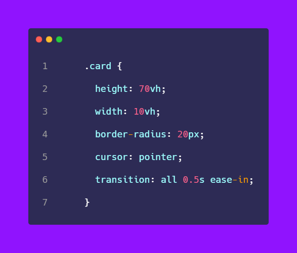
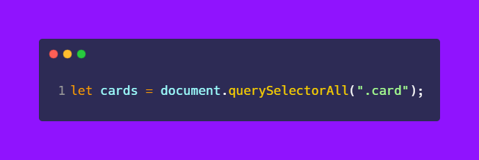
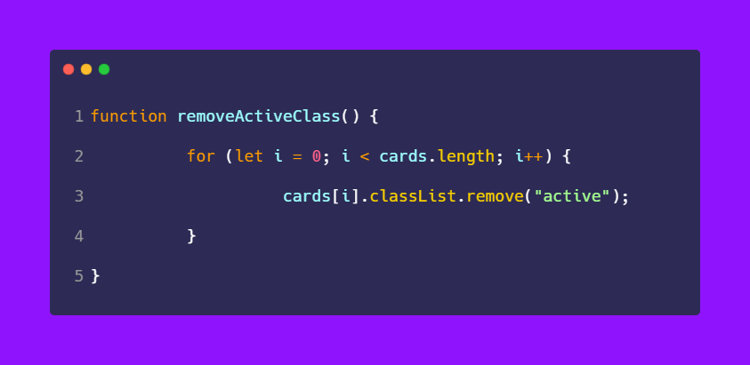
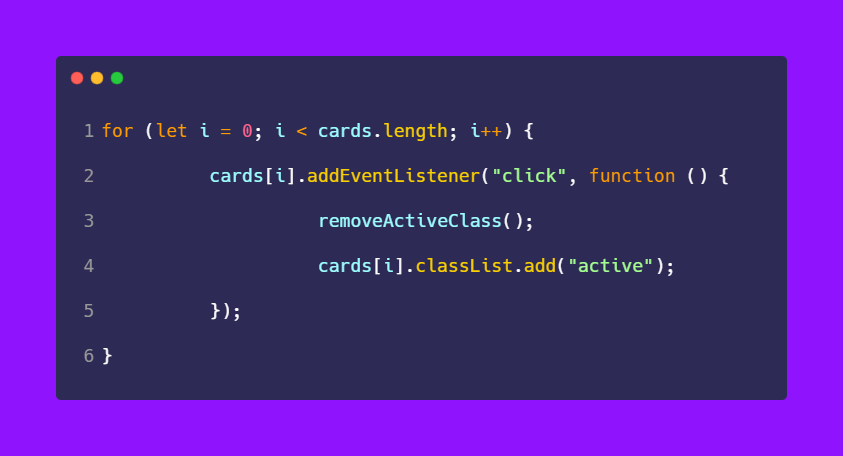

# 50-The-Ultimate-JavaScript-Projects-Series-

### 🎉 𝗘𝘅𝗽𝗮𝗻𝗱𝗮𝗯𝗹𝗲 𝗮𝗻𝗱 𝗰𝗼𝗹𝗹𝗮𝗽𝘀𝗶𝗯𝗹𝗲 elements.

[Try it on codepen](https://codepen.io/atechajay/full/yLvPxMQ) | [Read the thread on twitter](https://twitter.com/ATechAjay/status/1530027234479984640)

### 💡 Learning from this project?

📌 Remove & add the class at the same event.
📌 Expanding and collapsing logic

→ Just we have to increase the width of the card or box using JavaScript.

→ For example we can increase the width of the box from 100px to 500px using JavaScript.

___
### 🛠 How to build it? 👇

→ So first of all we have to write our HTML code for the card.

→ There are 7 children in a container with a "card" class names.

→ In the CSS code, we have to add a class that is an "active" class.

→ This class is responsible for expanding and collapsing the card.

→ If this class is applied to an element then the element will expand otherwise collapse.

→ This is the design of the cards and the width of the card is 10vh initially.

→ That means when the card is being collapsed the width of the card is 10vh.

→ When the "active" class is applied to an element then the width of the element will be increased to 60vh.

→ So first of all we have to select the HTML card elements using JavaScript.

→ And it returns the list of the NODE similar to an array.

→ So now we have to listen to events on each element that's why we need to loop all elements using for loop.

→ And just we have to add an "active" class to the element.

→ But before adding the "active" class to the element we have to remove the existing "active" class from the element.

→ So we have to create a new function for this requirement.

→ Finally, we have to call this function before adding the "active" class to the element.

→ In line number 3, I have called that function which is going to remove the "active" class from the element.

→ Then the "active" class is added to an element.

That's all 😍

---

🔔 Don't forget to give a star ⭐ to this repository, also if you didn't follow me on GitHub then consider following me.
