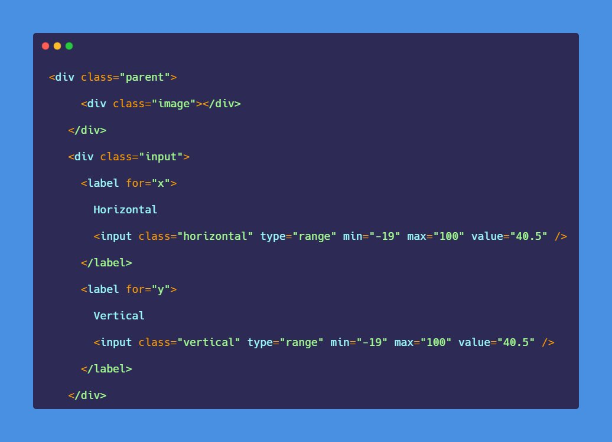
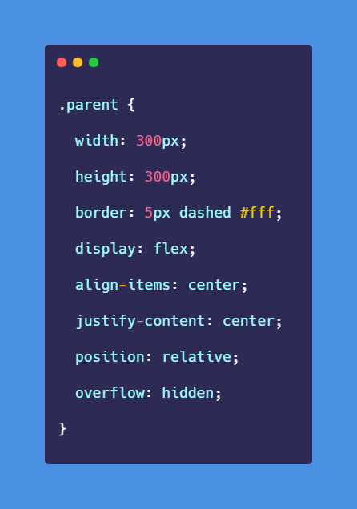
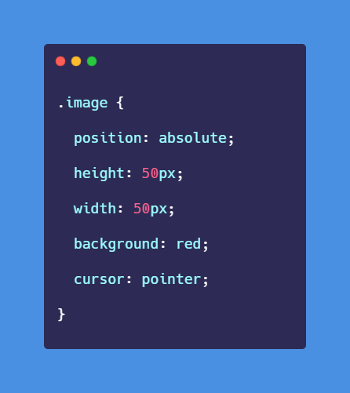
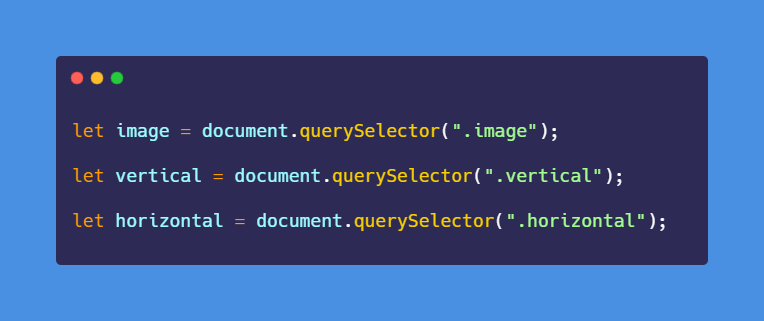
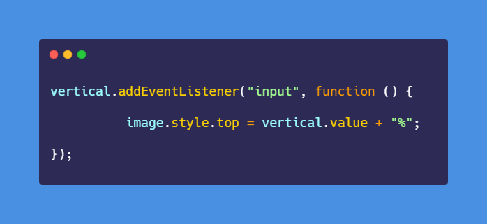
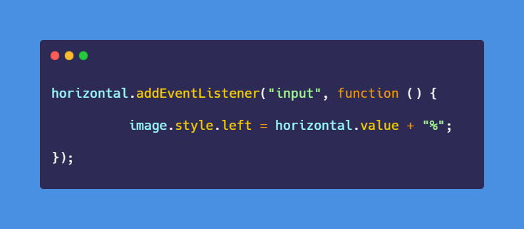

# 50-The-Ultimate-JavaScript-Projects-Series-

### Image Position Slide

[Try it on codepen](https://codepen.io/atechajay/full/wvyOGEY) | [Read the thread on twitter](https://twitter.com/ATechAjay/status/1537328834382483457)

___
### 🛠 How to build it? 👇

◓ This is the HTML code for this project.

💡 Values in the range input field:
- min = -19
- max = 100
- value = -19/100 => 40.5

◓ Now, this is the CSS code for the parent of this project.

▣ Position and overflow properties are most important to include.

▣ Then this div element is referred to as the image inside this parent element.

▣ The "absolute" is set to position property.

**_◓ JavaScript code for this project._**

▣ Now we have to select the required HTML elements using JavaScript.

▣ An image and both range input elements will be selected using JavaScript.

▣ Now, we have to listen to events on both range input elements.

▣ For the **vertical** image position inside the container, we have to collect the value from the range input element and concatenate it with the "%" unit.

▣ Then assigned it as the value of the "top" property.

▣ For the **horizontal** image position inside the container, we have to collect the value from the range input element and concatenate it with the "%" unit.

▣ Then assigned it as the value of the "left" property for the image element.

That's all 😍

---

🔔 Don't forget to give a star ⭐ to this repository, also if you didn't follow me on GitHub then consider following me.
